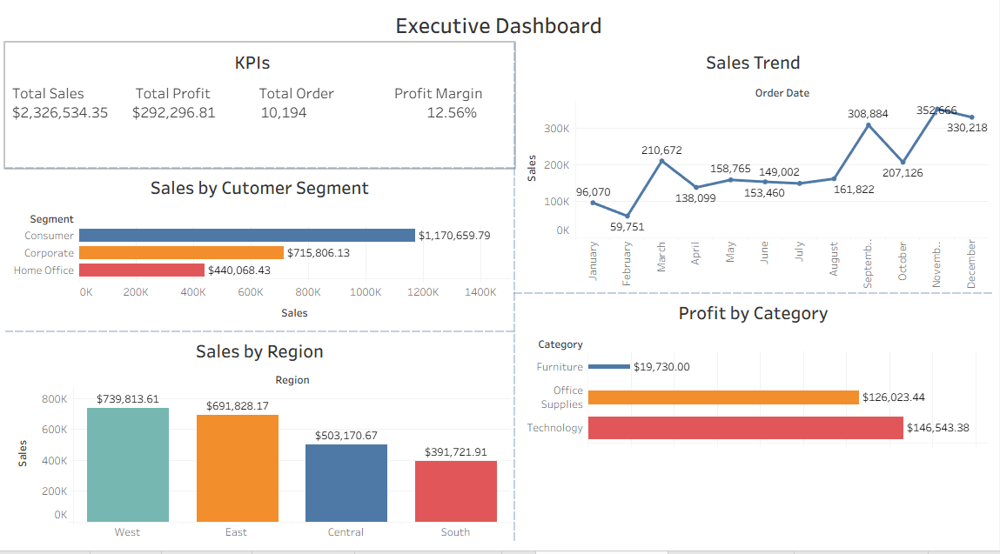

# Global SuperMart Retail Sales Performance Dashboard (Tableau)

## Project Overview
This project presents an interactive Tableau dashboard analyzing retail sales data to uncover insights into **sales trends, product performance, and regional profitability**.

The goal is to support business decision-making by identifying:
- High-performing regions
- Loss-making products
- Impact of discounts on profit
- Customer segment contributions

## Project Structure

Tableau-Retail-Sales-Dashboard
│
├── dataset
│ └── Sample-Superstore.xls
│
├── dashboard_images
│ ├── executive_dashboard.png
│ ├── product_analysis.png
│ └── regional_analysis.png
│
├── tableau_workbook
│ └── retail_dashboard.twbx
│
└── README.md

## Dashboards

### Executive Overview
- Total Sales, Profit, Orders, Profit Ratio
- Sales trends over time
- Sales by region and segment

### Product Performance Analysis
- Profit by sub-category
- Top and bottom performing products
- Discount vs Profit relationship

### Regional Sales Analysis
- Sales and profit by state (map)
- Regional comparison
- Sales vs Profit distribution

## Tools Used
- Tableau (Data Visualization)
- Microsoft Excel (Dataset)

## Key Insights
- Some high-sales products generate low or negative profit
- Discounts significantly impact profitability
- Certain regions outperform others in both sales and profit

## How to Use
1. Download the dataset from the `dataset` folder  
2. Open the `.twbx` file in Tableau  
3. Interact with filters and dashboards  

## Author
Damilola Oluwagbamila